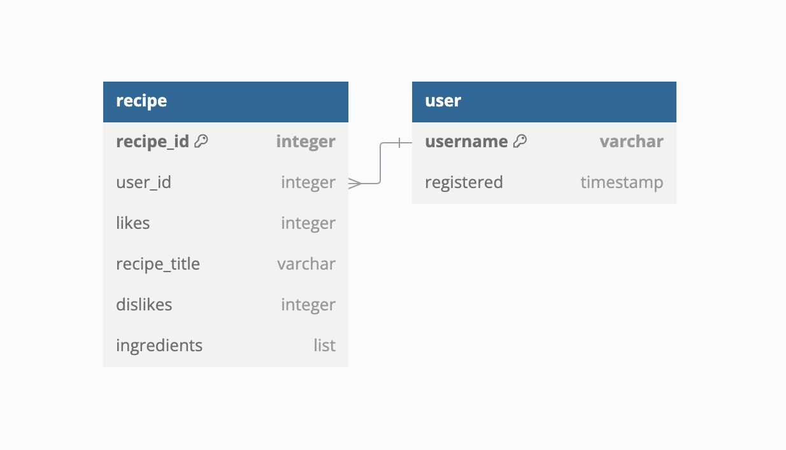

### ER-схема

Требования к проекту:
- Упаковка проекта в докер-компоуз и запуск через docker compose up без дополнительной настройки - пока живём
- Два формата запуска - через polling и через webhook - есть 
- прохождение flake8 + mypy в соответствии с конфигурациями проекта - пока нет
- Стейт отдельный под каждого пользователя - wtf???
- Без доступа к бд в сервисе aiogram - есть
- Метрики:  - заебали 
  - Время выполнения всех интеграционных методов (запросы на бекенд и телеграм)
  - Иметь свой декоратор для обертки таких методов. Использовать Histogram для подсчета времени
  - Сделать свою middleware для подсчета rps на сервис
  - Сделать счетчик отправленных из бота сообщений в очередь и полученных сообщений консумером 
- Настройки в env  - хоть что то есть 
- Без дублирования кода - ну всё относительно 
- poetry как сборщик пакетов - есть 
- Обработка ошибок и соответствующие ответы от бота - пока нет 
- Обработка флуда - флуд в каком смысле ёта 
- В README.md ожидается увидеть как что работает, чтобы можно было ознакомиться проще с проектом - вот это сойдёт?
- Сквозное логирование -  предположим 
- Если в сервисе используется хранилище s3(minio), то для этого сделать отдельную ручку. Можно использовать nginx - пока до ручки доведён только я 
- Обратить внимание на индексацию в моделях, подумать об unique_constraint - хорошо, зай